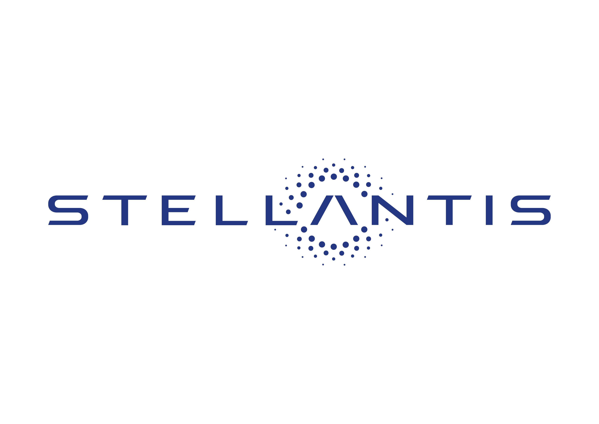

# Command-based Human-Robot Interaction framework

  
  
  

The repository is associated with my Ph. D. project carried out at the University of Salerno in collaboration with the Fiat Research Center (Stellantis) in Melfi and the Universitat Politècnica de Catalugna (UPC). The project consists in the realization of a robotic assistant operating on the production lines that is capable of understanding both speech and gesture commands in a highly noisy and dynamic environment such as the production lines of an automotive industry.
The obtained system has been successfully tested in the real scenarios offered by Stellantis.

The framework is self-consistent; in fact, it contains all the material to train the Speech-Command Recognition and Gesture-Command Recognition systems, to acquire the datasets for both tasks, for the creation of the docker on which to launch the ROS framework, finally there is the ROS architecture to run the entire Speech & Command Recognition system on an embedded devices.

Below is the list of hardware components used.
- Computing device: NVIDIA Jetson Xavier NX
- Storage unit: 32 GB microSD
- Camera: RealSense 435
- Microphone: ReSpeaker MicArray v2.0
