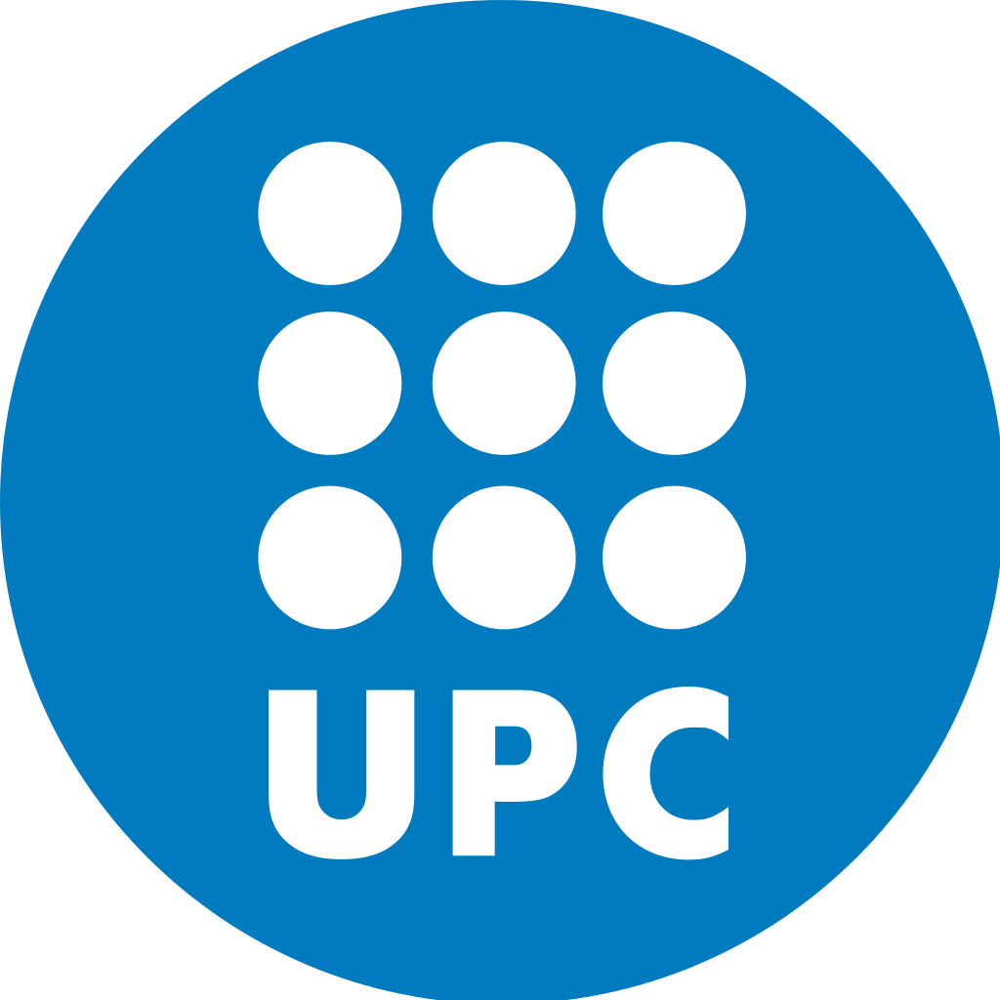

# Robotic Assistant for Automotive Production Lines

  
  &emsp;
  
  &emsp;
  

This GitHub repository is linked to my Ph.D. project conducted at the University of Salerno in collaboration with the Fiat Research Center (Stellantis) in Melfi and the Universitat Politècnica de Catalunya (UPC). The project focuses on the development of a robotic assistant designed for operation on automotive production lines. This advanced assistant is adept at comprehending both speech and gesture commands within the challenging and dynamic environment typical of automotive manufacturing.

**Key Features**
- **Speech and Gesture Recognition:** The system is equipped with robust Speech-Command Recognition and Gesture-Command Recognition capabilities, enabling seamless interaction with the robotic assistant.
- **Real-World Testing:** The developed system has undergone successful testing in real-world scenarios provided by Stellantis, demonstrating its practical applicability and effectiveness.

**Self-Contained Framework:**
- **Training Material:** The repository encompasses all necessary materials for training the Speech and Gesture Recognition systems.
- **Dataset Acquisition:** Tools for acquiring datasets relevant to both speech and gesture recognition tasks are included.
- **ROS Docker Image:** A Docker image is provided for easy deployment of the ROS (Robot Operating System) framework.
- **ROS Architecture:** The repository also contains the ROS architecture necessary for running the complete Speech & Command Recognition system on embedded devices.

**Hardware Components:**
- **Computing Device:** NVIDIA Jetson Xavier NX
- **Storage Unit:** 32 GB microSD
- **Camera:** RealSense 435
- **Microphone:** ReSpeaker MicArray v2.0

Explore the comprehensive resources within this repository to enhance your understanding of the project, replicate experiments, or contribute to its further development. Your feedback and collaboration are highly appreciated!

## Gesture-Command Recognition system
<!-- 

    

 -->

## Speech-Command Recognition system
