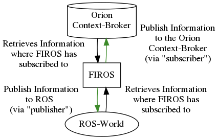

# Configuration-Files

FIROS needs 2 different configuration files inside the Configuration-Folder. An example Configuration-Folder can be
found in the `config`-Folder at the base of this repository. It needs to contain the files `config.json` and
`topics.json` (optionally: `whitelist.json`).

In the follwing each of the configuration files are explained in detail:

---

## `config.json`

The `config.json`-Configuration contains all basic FIROS-Configuration-Parameters which can be manipulated by the user.
No parameters are required, but you should specify it anyway, since you need to give FIROS Parameters, so that it can
publish and subscribe on that.

Inside this file you can specify multiple configurations. Via the `"environment"`-attribute you can select a specific
configuration as shown in the following example:

```json
{
    "environment": "test",

    "test": {
        "context_type": "MyRobotContextType",
        "server": {
            "port": 10100
        },
        "contextbroker": {
            "address": "192.168.0.97",
            "port": 1026,
            "subscription": {
                "throttling": "0",
                "subscription_length": 300,
                "subscription_refresh_delay": 0.9
            }
        },
        "endpoint": {
            "address": "10.16.55.3",
            "port": 1234
        },
        "log_level": "INFO"
    }
}
```

We also added here the contextbroker configuration, since we want to publish and subscribe data onto it.

Here is the list of all currently possibilities for a configuration:

| Attribute              | Value                                                                                                                                                      |                        Required                         |
| ---------------------- | ---------------------------------------------------------------------------------------------------------------------------------------------------------- | :-----------------------------------------------------: |
| "endpoint"             | An object, which can have an `address` and a `port`. If the Address differs, where FIROS should get the notifications from, then add this here.            |                                                         |
| "log_level"            | Can be either `"INFO"` (Default), `"DEBUG"`, `"WARNING"`, `"ERROR"` or `"CRITICAL"`.                                                                       |                                                         |
| "node_name"            | This sets the ROS-Node-Name for this FIROS instance. The default is `"firos"`.                                                                             |                                                         |
| "ros_subscriber_queue" | The queue-size of the `rospy.Publisher`. See more [here](http://wiki.ros.org/rospy/Overview/Publishers%20and%20Subscribers). Default is `10`               |                                                         |
| "rosbridge_port"       | Changes the ROS-Port, where to listen. Default is `9090`                                                                                                   |                                                         |
| "server"               | An object `{}` which contains the attribute `"port"`                                                                                                       |                                                         |
| "contextbroker"        | An object `{}` which contains the attributes `"adress"`, `"port"` and `"subscriptions"`                                                                    | (`x`, firos should at least know where to publish data) |
| "pub_frequency"        | An Integer of Milliseconds. This limits the number of publishes e.g. to the Context-Broker. This blocks the next publish for `pub_frequency` milliseconds. |                                                         |

### `"server"`-Configuration

The server configuration only has one attribute `"port"` which is defaulting to `10100`. You can change the port if you
experience errors. This usually occurs when this port is already occupied by another application.

### `"contextbroker"`-Configuration

The contextbroker configuration need to specifiy the `"address"` and `"port"` attribute to point to a running
Context-Broker. If you are running a local Context-Broker, `"address"` can also be set to `"localhost"`.
`"subscriptions"`-value is again another object `{}` which can contain the following:

| Attribute                    | Value                                                                                                                                                                                                                                                                                |
| ---------------------------- | ------------------------------------------------------------------------------------------------------------------------------------------------------------------------------------------------------------------------------------------------------------------------------------ |
| "throttling"                 | The throttling value as specified [here](https://fiware-orion.readthedocs.io/en/master/user/ngsiv2_implementation_notes/index.html#notification-throttling). Default is set to `0`.                                                                                                  |
| "subscription_length"        | The subscription length on the Context-Broker in seconds. Default is `300`. This only sets the [subscription length `expires` attribute](https://fiware-orion.readthedocs.io/en/master/user/walkthrough_apiv2/index.html#subscriptions).                                             |
| "subscription_refresh_delay" | Depending on the subscription length, this value tells FIROS when to refresh a subscription. Default is set to `0.9` and cannot be larger than `1` or lower than `0`. It refreshes automatically the subscription in `"subscription_length" * "subscription_refresh_delay"` seconds. |

---

## `robots.json`

This configuration describes which information the FIROS-instance should publish to the Non-ROS-World and publish into
the ROS-World. There exist two different point of views: so we decided, that the publish-subscribe-terminology is at the
Non-ROS-World (e.g. Context-Brokers) point of view. Here is an example to publish `turtlesim`'s message/topic
`Pose`-information into the Non-ROS-World by subscribing to it. Accordingly, if the Non-ROS-World somehow receives any
Information about the `cmd_vel` (`Twist`-Information), its data is published into the ROS-World:

```json
{
    "/turtle1/cmd_vel": ["geometry_msgs/Twist", "publisher"],
    "/turtle1/pose": ["turtlesim/Pose", "subscriber"]
}
```

This json in particular listens to the rostopic `/turtle1/pose` with the message type `"turtlesim/Pose"` (the
corresponding python message from `turtlesim/Pose`) and sends all retreived data to the specified server in the
Non-ROS-World. It publishes data into `/turtle1/cmd_vel` after receiving a notifcation of the server from the
Non-ROS-World from type `geometry_msgs/Twist`.

To clarify this behaviour, please have a look at this example with the Non-ROS-World being an Orion Context-Broker :



The green arrows are specified by the `config.json` (and `whitelist.json`). The corresponding black arrows are derived
from the green arrows, which happens automatically.

You do not have to specify `publisher` and `subscriber` of all available topics or at all for a robot. Only specify the
needed ones, which need to be displayed from/or need to obtain information on the Non-ROS-World

The Information given by the `robots.json` is appended/replaced to the `whitelist.json` which is described below.

---

## `whitelist.json`

As the name suggests, the `whitelist.json` functions as a whitelist to let FIROS know which messages it should keep
track of. Given an environment where already ROS-Applications are running, FIROS will not automatically subscribe to all
available topics if no `whitelist.json` is given. In a small ROS-World with few ROS-Applications, it can be desirable to
subscribe to all topics. This can be achieved via:

```json
{
    "publisher": [],
    "subscriber": [".*"]
}
```

But this can cause problems in a ROS-World, where many ROS-Applications are running. To let FIROS only subscribe to
specific topics, the following configuration can be used:

```json
{
    "publisher": [".*/pose"],
    "subscriber": [".*/cmd_vel"]
}
```

This only allows FIROS to subscribe/publish to specific topics plus the extra-configuration given in `robots.json` which
in the above example would also be `"/turtle1/pose"` and `"/turtle1/cmd_vel"`.

**Note:** The FIROS only captures running ROS-Applications at the startup. All applications started after FIROS will not
be recognized.

**Note:** The `whitelist.json` does not need to know the actual Message-Type. FIROS automatically looks up the
Message-Type. However, the "Message-Implementation" still needs to be present locally at the FIROS-Instance (via the
`msgs`-Folder, or compiled by catkin)

The `whitelist.json` also supports more complex Regular Expressions (Regex), so you can refer to more topics in just a
few lines.
